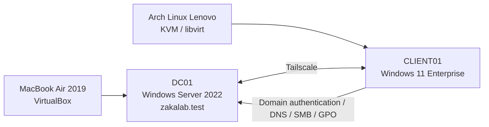
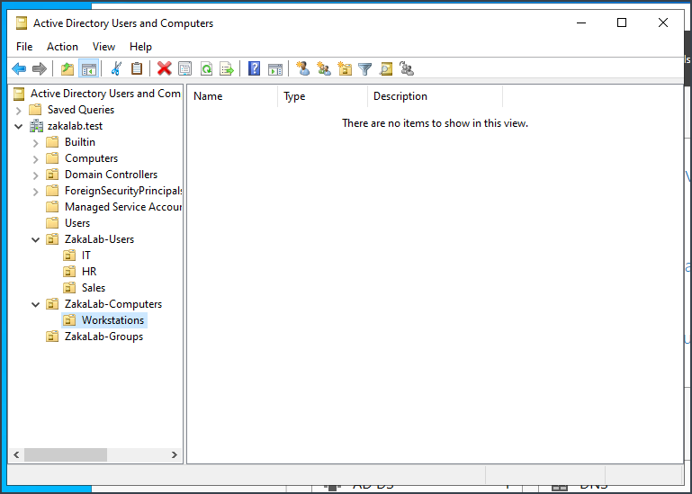
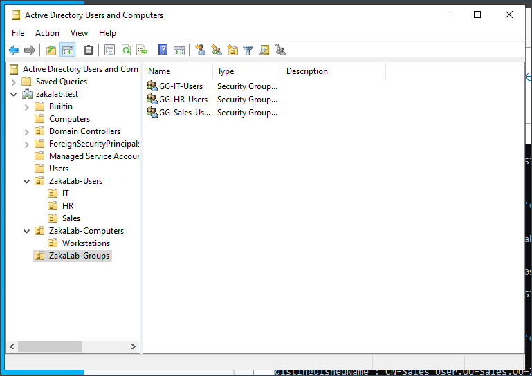
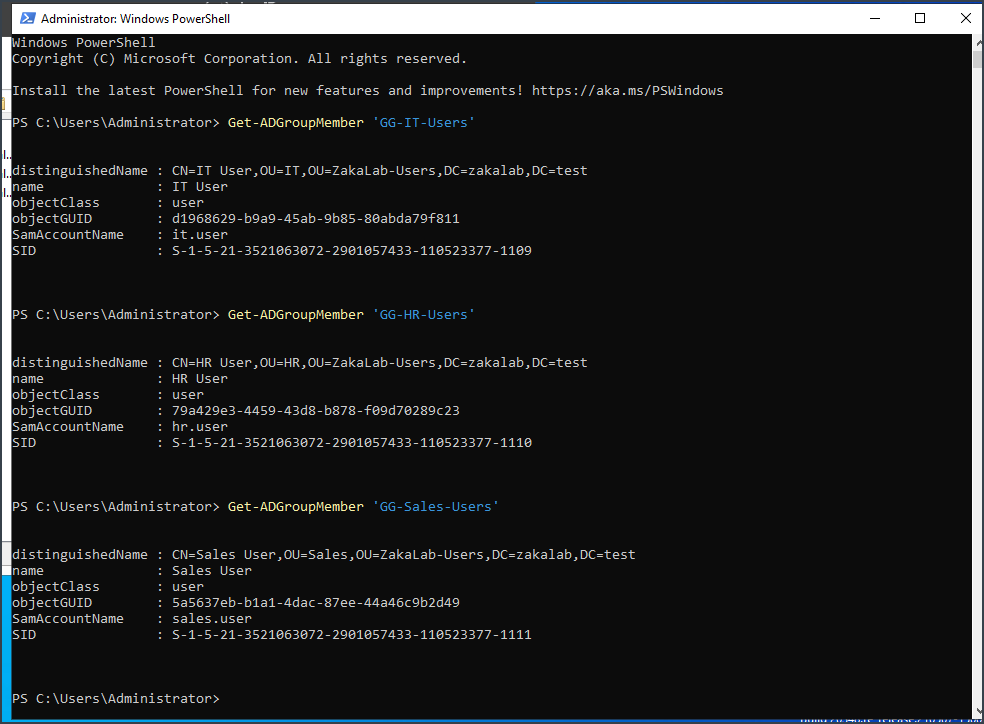
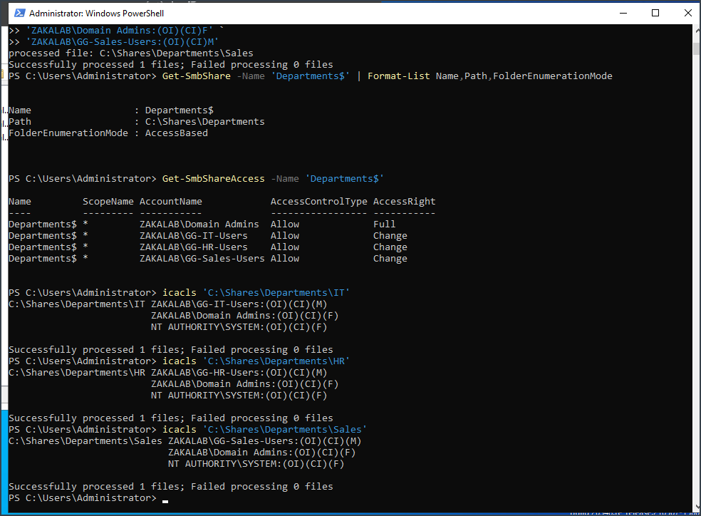
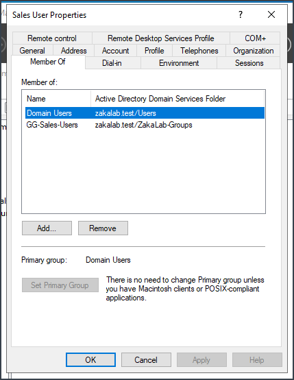
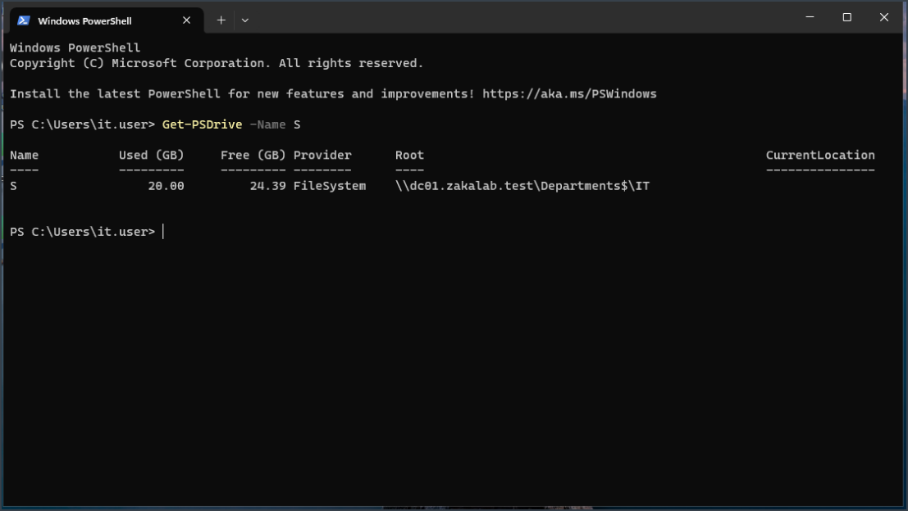
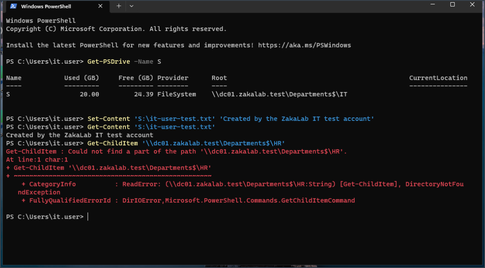
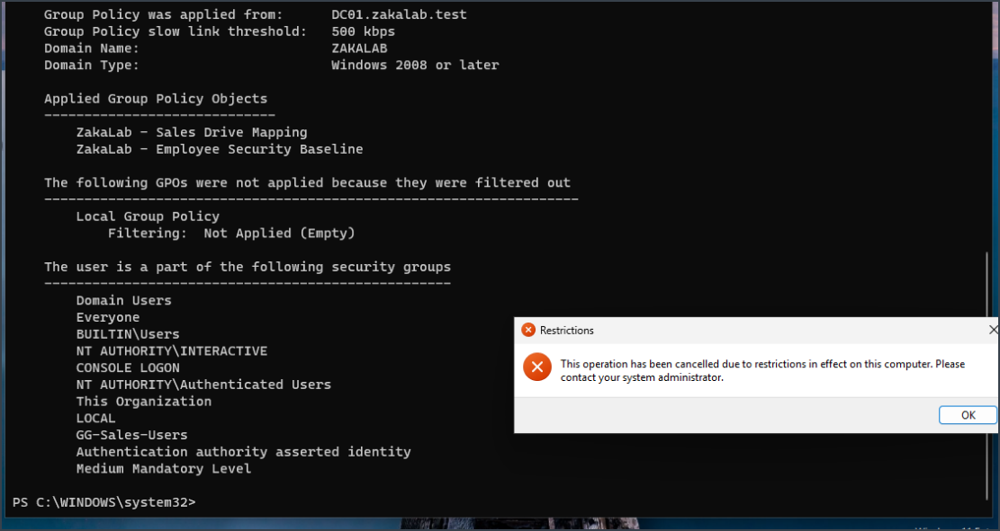

# Active Directory & Group Policy Deployment Lab

A hands-on Windows Server 2022 lab built to simulate a small business Active Directory environment across two physical hosts. The project covers domain services, DNS, domain-joined endpoints, organizational units, security groups, SMB file sharing, NTFS permissions, Group Policy, and PowerShell-based validation.

## Lab Architecture



### Core Systems

| System | Role |
|---|---|
| `DC01` | Windows Server 2022 domain controller |
| `CLIENT01` | Windows 11 Enterprise domain-joined workstation |
| `zakalab.test` | Active Directory forest/domain |
| Tailscale | Private connectivity between VMs hosted on separate physical machines |

## Technologies Used

- Windows Server 2022
- Windows 11 Enterprise
- Active Directory Domain Services
- DNS Server
- Group Policy Management
- SMB file sharing
- NTFS permissions / `icacls`
- PowerShell
- VirtualBox
- KVM / libvirt / virt-manager
- Tailscale
- Arch Linux
- UFW

## Features Implemented

- Deployed a new Active Directory forest: `zakalab.test`
- Promoted `DC01` to a domain controller
- Configured AD-integrated DNS and verified LDAP SRV records
- Joined `CLIENT01` to the domain
- Created departmental OUs for IT, HR, and Sales
- Created global security groups for department-based access control
- Created test employee accounts and assigned group membership
- Created an SMB department share with Access-Based Enumeration
- Configured NTFS permissions using department security groups
- Deployed department drive mappings with Group Policy Preferences
- Applied an employee security baseline using Group Policy
- Tested authorized and unauthorized file access
- Built a PowerShell health-check script to validate the lab

## Active Directory Structure

```text
zakalab.test
│
├── ZakaLab-Users
│   ├── IT
│   ├── HR
│   └── Sales
│
├── ZakaLab-Computers
│   └── Workstations
│       └── CLIENT01
│
└── ZakaLab-Groups
    ├── GG-IT-Users
    ├── GG-HR-Users
    └── GG-Sales-Users
```



### Security Groups

Department users were assigned to Global Security Groups rather than receiving permissions directly.



PowerShell was used to verify group membership:



## File Sharing and Access Control

A hidden SMB share was created at:

```text
\\dc01.zakalab.test\Departments$
```

Department folders:

```text
Departments$
├── IT
├── HR
└── Sales
```

Access was controlled with both share permissions and NTFS permissions. Access-Based Enumeration was enabled so unauthorized users could not browse other departments' folders.



Example user-to-group assignment:



## Group Policy Configuration

### Department Drive Mapping

Each department OU received its own user GPO that maps drive `S:` to the appropriate department share.

Example for the IT user:

```text
S: -> \\dc01.zakalab.test\Departments$\IT
```



### Access Control Validation

The IT test account successfully created and read a file inside the IT share while the HR path remained unavailable to that user.



### Employee Security Baseline

A user security GPO was linked to the employee OU structure. It included restrictions such as blocking access to Control Panel / PC Settings and applying screen-lock related settings.



## PowerShell Automation

The `scripts/ZakaLab-HealthCheck.ps1` script validates:

- Domain information
- Core AD/DNS/Netlogon services
- Lab users
- Lab security groups
- `CLIENT01`
- Department SMB share
- ZakaLab Group Policy Objects

Run from an elevated PowerShell session on `DC01`:

```powershell
Set-ExecutionPolicy -Scope Process Bypass
.\scripts\ZakaLab-HealthCheck.ps1
```

## Troubleshooting Highlights

This lab required troubleshooting across Windows, Linux, virtualization, DNS, firewalling, and Active Directory.

Key issues resolved included:

- Windows 11 initially received an APIPA `169.254.x.x` address because UFW blocked libvirt DHCP/DNS traffic.
- Added interface-specific UFW rules for DNS (`53`) and DHCP (`67`) on `virbr0`.
- Corrected an invalid forwarding rule that referenced `SWAN_IF` instead of the actual Wi-Fi interface `wlp0s20f3`.
- Restored outbound HTTPS connectivity from the Windows VM through libvirt NAT.
- Connected two VMs running on separate physical hosts through Tailscale.
- Diagnosed AD DNS/SRV record registration and ensured the domain controller answered DNS on its Tailscale address.
- Resolved domain-join and first-login connectivity issues.
- Reworked an initial item-level-targeted drive-mapping design into simpler OU-linked department GPOs.

More detail is available in [`docs/troubleshooting.md`](docs/troubleshooting.md).

## Validation

The completed lab was validated using:

```powershell
whoami
Get-CimInstance Win32_ComputerSystem
Test-ComputerSecureChannel -Verbose
gpupdate /force
gpresult /r /scope:user
Get-PSDrive -Name S
Get-SmbShareAccess -Name 'Departments$'
Get-ADGroupMember
Resolve-DnsName
```

## Skills Demonstrated

- Windows Server administration
- Active Directory administration
- DNS configuration and troubleshooting
- Group Policy design and validation
- Identity and access management
- Security group administration
- SMB / NTFS permissions
- Role-based access control
- Windows endpoint domain integration
- PowerShell administration
- Linux firewall and virtualization troubleshooting
- Cross-platform networking
- Technical documentation

## Future Improvements

- Add a second domain controller for redundancy
- Deploy software through Group Policy
- Add Windows Event Forwarding
- Add DHCP Server to the Windows environment
- Add additional workstation clients
- Add automated user provisioning and deprovisioning
- Add security auditing and centralized logging
